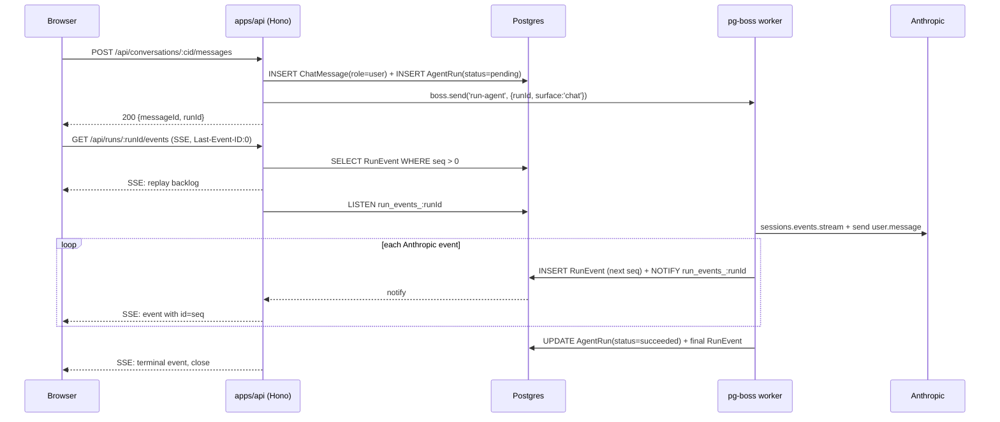

# Architecture

`open-agents` is a **single-tenant agent platform**. One Postgres-backed
deployment hosts many agents that an admin creates, configures, and
shares from a web UI. Each agent has a chat surface and an optional email
surface; both share the same worker, queue, and durable run-event log.

## Components at a glance

```
                      ┌──────────────────────┐
                      │  Browser (Vite SPA)  │
                      └─────────┬────────────┘
                                │  HTTPS + cookies + SSE
                                ▼
   ┌───────────────────────────────────────────────────────────────┐
   │                  apps/api (Hono on Node)                      │
   │                                                               │
   │  • better-auth /api/auth          • /api/agents (CRUD)        │
   │  • setup wizard /setup            • /api/conversations        │
   │  • catch-all /mailgun/inbound     • /api/runs/:id/events SSE  │
   │  • /mcp/:slug Streamable HTTP     • /api/secrets, users, …    │
   │                                                               │
   └─────┬───────────────────────────┬───────────────────────┬─────┘
         │ Prisma + LISTEN/NOTIFY    │ pg-boss enqueue       │ HTTP
         ▼                           ▼                       ▼
   ┌──────────────┐         ┌────────────────────┐   ┌──────────────────┐
   │  Postgres    │         │ pg-boss workers    │   │  Anthropic       │
   │  Prisma +    │◀────────┤ run-agent          │   │  Managed Agents  │
   │  pg-boss +   │ NOTIFY  │ send-email         │──▶│  (sessions/files │
   │  RunEvent    │         └─────────┬──────────┘   │   /agents/skills)│
   └──────┬───────┘                   │              └────────┬─────────┘
          │ SSE bridge                │ Mailgun HTTP          │ MCP HTTP
          ▼                           ▼                       │
   browser EventSource            Mailgun outbound            │
                                                              │
   user reply ──▶ Mailgun catch-all ──▶ POST /mailgun/inbound │
   sandbox tool call ─────────────────────────────────────────┘
```

## Surfaces

### Web chat (durable, reconnect-replayable)



If the browser drops, the worker keeps running. On reconnect the
EventSource sends `Last-Event-ID`, the API replays missed `RunEvent`
rows, then switches back to live `LISTEN/NOTIFY`. Tool calls render as
collapsed pills (`Used <toolName>`); aggregated assistant text streams
from `agent.message` events.

### Email

```
user mail client ──▶ Mailgun ──▶ POST /mailgun/inbound (catch-all)
                                           │
                                 verify HMAC over timestamp+token
                                           │
                                 parse recipient → Agent.inboundLocalPart
                                           │
                                 services/inbound: persist EmailMessage
                                                    + EmailAttachment(bytes)
                                           │
                                 boss.send("run-agent", {runId, surface:"email"})
                                           │
                                           ▼
                                  run-agent worker (same one as chat)
                                           │
                                 emit RunEvent rows + final assistant text
                                           │
                                 boss.send("send-email", {runId})
                                           │
                                           ▼
                                  send-email worker
                                           │
                                 react-email render → Mailgun outbound
```

There is **one** Mailgun route (`POST /mailgun/inbound`). The agent is
resolved by parsing the recipient against `Agent.inboundLocalPart`. If
the agent has `emailEnabled = false` the request returns 200 and the
message is dropped (so Mailgun won't retry).

Email and web chat **never share state**. Each surface owns its own
threading table (`EmailThread` / `ChatConversation`) and creates its own
Anthropic sessions.

## HTTP surface

| Prefix                                                                                                                 | Purpose                                               | Auth                                |
| ---------------------------------------------------------------------------------------------------------------------- | ----------------------------------------------------- | ----------------------------------- |
| `/api/auth/*`                                                                                                          | better-auth catch-all (sign in, session, sign out)    | session cookie                      |
| `/api/setup`, `/api/setup/status`                                                                                      | First-run wizard                                      | none until completed, then admin    |
| `/api/agents`, `/api/users`, `/api/tools`, `/api/skills`, `/api/secrets`, `/api/conversations`, `/api/runs/:id/events` | Control-plane API consumed by the SPA                 | session cookie + role/access guards |
| `/mailgun/inbound`                                                                                                     | Catch-all Mailgun webhook                             | Mailgun HMAC over `timestamp+token` |
| `/mcp/:agentSlug`                                                                                                      | Streamable-HTTP MCP server, one logical handler/agent | Shared bearer (`MCP_AUTH_TOKEN`)    |
| `/runs/:runId/attachments`                                                                                             | Sandbox uploads files for the email reply             | HMAC signature on the URL           |
| `/conversations/:id/attachments`                                                                                       | User uploads files into a chat                        | session cookie                      |
| `/health`, `/health/ready`                                                                                             | Liveness + DB ping                                    | none                                |
| `/static/*`                                                                                                            | Email assets                                          | none                                |

The app builder lives in
[`apps/api/src/server/app.ts`](../apps/api/src/server/app.ts) and route
prefixes are declared in
[`apps/api/src/routes/prefixes.ts`](../apps/api/src/routes/prefixes.ts).
A global `attachUser` middleware reads the better-auth session cookie
and stamps `c.var.user` for downstream guards.

## Agent definition

Agents live entirely in **our** Postgres. The static `AGENTS` array and
side-effect imports are gone. Agents are managed exclusively through:

- **Web UI** — `/agents` list + `/agents/<slug>/edit` form.
- **API** — `/api/agents` (CRUD), `/api/agents/<slug>/publish`.
- **Service layer** —
  [`apps/api/src/agents/service.ts`](../apps/api/src/agents/service.ts)
  (`createAgent`, `updateAgent`, `deleteAgent`, `listAgents`,
  `getAgentBySlug`, `getAgentByInboundLocalPart`, `publishAgent`).

A small in-process `Map` cache fronts the DB lookups; mutations
invalidate it locally. Lookups by slug, id, or inbound local-part are
all O(1) on a hit. The cache is not coordinated across processes — v1
is single-process, but if you scale horizontally, restart writers (or
add a NOTIFY-driven invalidation channel) to avoid stale reads.

### Publishing to Anthropic

`publishAgent(slug)` builds the Anthropic payload from the local row
plus its bindings:

- `name`, `model`, `system` from the `Agent` row
- one `agent_toolset_20260401` block, default-disabled, with one
  `configs[]` entry per bound `Tool` of `runtime = "managed"`
  (`bash`/`read`/`write`/`edit`/`glob`/`grep`/`web_fetch`/`web_search`)
- one `mcp_toolset` for our per-agent `/mcp/<slug>` server, plus a
  matching entry in `mcp_servers`, when at least one bound `Tool` has
  `runtime = "platform"`
- one `mcp_toolset` + `mcp_servers` entry per `AgentThirdPartyMcp` row
- skill ids serialized as `{ type: "custom", skill_id, version: "latest" }`

Then it calls `client.beta.agents.create` (first publish) or
`client.beta.agents.update` (subsequent), records the returned version
string on `Agent.anthropicAgentVersion`, and inserts a new `AgentVersion`
row holding the full payload snapshot. The returned `anthropicAgentId`
and `environmentId` are also persisted on the row so subsequent sessions
can reference them directly.

The Anthropic-specific shape is built **only** here. The rest of the
codebase sees `Tool` rows discriminated by `runtime`; a future
non-Anthropic agent backend would need a different translator in this
file but no further changes downstream.

## Job queue (pg-boss)

Two queues, sharing the same Postgres as Prisma:

| Queue        | Producer                                                    | What it does                                                                                                                |
| ------------ | ----------------------------------------------------------- | --------------------------------------------------------------------------------------------------------------------------- |
| `run-agent`  | inbound webhook + `POST /api/conversations/:id/messages`    | uploads new attachments → resumes/creates session → streams Anthropic events into `RunEvent` rows → marks `AgentRun.status` |
| `send-email` | `run-agent` worker on `surface = "email"` runs that succeed | renders the react-email template → POSTs to Mailgun → records the outbound `EmailMessage`                                   |

Workers wrap their handler in try/catch; on failure they update the
relevant row (`AgentRun.status = "failed"`), emit a `run.failed`
`RunEvent` so any subscribed SSE client sees the terminal event, then
re-throw so pg-boss can retry. The canonical pattern lives in
[`apps/api/src/jobs/runAgent.ts`](../apps/api/src/jobs/runAgent.ts).

## Run-event log

Every interesting Anthropic stream event is persisted as a `RunEvent`
row with a monotonic per-run `sequence`. Producer side
([`runs/events.ts`](../apps/api/src/runs/events.ts)) writes the row and
emits `pg_notify('run_events_<runId>', payload)`. Consumer side (the
SSE handler) reads the backlog after `Last-Event-ID`, then bridges live
notifications into the EventSource stream. The terminal event
(`run.succeeded` / `run.failed`) closes the stream.

## MCP server

[`apps/api/src/mcp/server.ts`](../apps/api/src/mcp/server.ts) builds a
per-agent `McpServer` from the agent's tool bindings:

- It walks `AgentToolBinding`, skips any binding whose `Tool.runtime` is
  `managed` (those run on Anthropic's container, not here), looks up
  the `PlatformHandler` by `Tool.key` against `mcp/platform/index.ts`,
  and registers every tool descriptor that handler exposes (e.g. the
  `memory` handler exposes `memory_create`, `memory_read`, etc.).
- Per-binding secrets are passed to the handler via
  `getToolSecrets(bindingId)`.
- The route in [`routes/mcp.ts`](../apps/api/src/routes/mcp.ts)
  authenticates with the shared `MCP_AUTH_TOKEN` bearer, builds a fresh
  transport per request (the SDK's stateless transport is single-use),
  and dispatches to the assembled server.

Third-party MCP servers (pasted into the **Edit agent** form) are NOT
served here — they live in the published Anthropic agent's `mcp_servers`
config and Anthropic's sandbox calls them directly.

## Auth (better-auth)

Email/password only. Public sign-up is **disabled** — admins create
users from `/settings/users`. Roles are `admin` and `member`. Guards:

- `attachUser` (global) — reads session cookie, sets `c.var.user`.
- `requireUser` — 401 if not signed in.
- `requireAdmin` — 403 if `user.role !== "admin"`.
- `requireAgentAccess(agent)` — admin always passes; otherwise checks
  `agent.accessMode === "everyone"` or an `AgentAccess` row exists.

The first request in a fresh deployment redirects to `/setup`. The
wizard creates the first admin and stores Anthropic / Mailgun
credentials in the encrypted `Secret` table.

## Secrets

[`apps/api/src/secrets/`](../apps/api/src/secrets/) implements an
AES-256-GCM-backed `Secret` table and process-cached readers:

- `getServiceSecret("anthropic_api_key" | "mailgun_api_key" | …)` — used
  by the Anthropic client and the Mailgun client. Both have a
  `reset…()` function the secrets-CRUD route calls on rotation.
- `getToolSecrets(bindingId)` — passed into platform tool handlers when
  a binding has secrets attached (e.g. an OAuth token for an integration).

The encryption key is `SECRET_ENCRYPTION_KEY` (32-byte hex, env-injected
at boot). The plaintext values never leave the server — the API only
ever returns whether a key is configured, never its value.

## Layering rules

```
routes/  ─┐
          ├──▶ services/ ──▶ db.ts, agents/service.ts, anthropic/*, mailgun/*, mcp/, secrets/
jobs/   ─┘
```

- **`routes/`** — parse, authenticate, delegate. No Prisma writes inline.
- **`jobs/`** — orchestration shells. Heavy lifting goes in `services/`.
- **`services/`** — reusable domain logic. Imports `db.ts`, `anthropic/*`,
  `mailgun/*`, `agents/*`, `mcp/*`, `secrets/*`, other `services/*`.
  Must NOT import from `routes/` or any `jobs/<workerName>.ts`.
- **`agents/`, `mcp/`, `mailgun/`, `anthropic/`, `secrets/`, `auth/`** —
  leaf-ish modules. Import `db.ts`, `log.ts`, `config.ts`, and each
  other (acyclic).

## Data model

The full schema lives in
[`packages/db/prisma/schema.prisma`](../packages/db/prisma/schema.prisma);
this list is the orientation map.

### Auth (better-auth)

`User`, `Session`, `Account`, `Verification`. `User.role` is `admin`
or `member`.

### Agents and bindings

- `Agent` — `id`, `slug`, `displayName`, `description`, `systemPrompt`
  (mirrored locally for editing UX), `model` (Anthropic model id),
  `emailEnabled`, `webEnabled`, `accessMode` (`everyone` | `specific`),
  `inboundLocalPart`, `anthropicAgentId`, `environmentId`,
  `anthropicAgentVersion`, …
- `AgentVersion` — snapshot of the payload sent to Anthropic on every
  publish, plus the returned version string. Used as an audit log of
  what was actually pushed.
- `AgentAccess` — `(agentId, userId)` rows for `accessMode = specific`.
- `Tool` — unified catalog of every capability an agent can be bound
  to. `runtime = "managed"` rows are members of Anthropic's
  `agent_toolset_20260401` (`bash`, `read`, `write`, `edit`, `glob`,
  `grep`, `web_fetch`, `web_search`); `runtime = "platform"` rows are
  code-shipped handlers in `mcp/platform/`. Both runtimes are seeded
  automatically by
  [`services/seedToolCatalog.ts`](../apps/api/src/services/seedToolCatalog.ts).
  Third-party MCP server URLs do **not** go here — they live on the
  agent (see `AgentThirdPartyMcp` below).
- `AgentToolBinding` — `(agentId, toolId)` plus `configJson`. The same
  table backs both managed and platform bindings; the `Tool.runtime`
  discriminates downstream.
- `AgentThirdPartyMcp` — third-party MCP servers attached to the
  agent. `(agentId, label, serverUrl)` plus optional inline-encrypted
  bearer (`bearerCipher` / `bearerIv` / `bearerTag`). On publish, each
  row becomes an entry in the Anthropic agent's `mcp_servers` array.
- `Skill` — `name`, `description`, local `bundleStorageRef`,
  optionally `anthropicSkillId` + `anthropicSkillVersion` once
  reflected to Anthropic.
- `AgentSkillBinding` — `(agentId, skillId)`.

### Memory

- `MemoryDoc` — `(agentId, collection, doc Json, …)`. The generic memory
  tool (`memory_collections` / `memory_create` / `memory_read` /
  `memory_list` / `memory_update` / `memory_delete`) operates on these
  scoped to the calling agent. Collections are free-form strings, so
  `memory_collections` exists specifically for the agent to discover
  what it has populated across sessions before reading or writing.

### Secrets

- `Secret` — `scope` (`service` | `tool`), `key`, `iv`, `authTag`,
  `ciphertext`. `bindingId` is set when `scope = tool`.

### Conversations / runs / events

- `ChatConversation` — owned by a `User`, scoped to an `Agent`. Holds
  `anthropicSessionId` (rotated when attachments force a new session).
- `ChatMessage` — `role` (`user` | `assistant` | `system`),
  `content`, `runId?`.
- `AgentRun` — one per turn. `surface` (`email` | `chat`),
  `conversationId?`, `threadId?`, `status`, `output` (final
  aggregated assistant text — read by `send-email` worker).
- `RunEvent` — `(runId, sequence, type, payload Json, createdAt)`.
  Indexed `(runId, sequence)`.

### Email pipeline

- `EmailThread` — `(agentId, address)`, holds `anthropicSessionId`,
  `inboundAddress`, `subject`, etc.
- `EmailMessage` — every inbound/outbound message; deduped by
  `mailgunMessageId`.
- `EmailAttachment` — bytes from the inbound webhook; gets uploaded to
  Anthropic Files when the run-agent worker picks the job up.
- `AgentAttachment` — files the agent uploaded back via the signed
  `/runs/:runId/attachments` endpoint; the send-email worker attaches
  them to the outbound reply.

## Bootstrap order

[`apps/api/src/server/lifecycle.ts`](../apps/api/src/server/lifecycle.ts)
runs init in this exact order:

1. `prisma.$connect()`.
2. `seedToolCatalog()` — upserts a `Tool` row for every platform handler
   AND for every member of Anthropic's `agent_toolset_20260401`, so the
   UI tool picker stays in sync with the code.
3. `getBoss()` + register `run-agent` and `send-email` workers.
4. `buildApp()` and start listening.
5. Install `SIGINT`/`SIGTERM` handlers that drain pg-boss, stop the
   `LISTEN` connection, and disconnect Prisma cleanly.

## Why the boundaries look the way they do

A handful of decisions worth explaining once:

- **MCP server is per-agent.** Each agent's tools live on its bindings;
  the route mounts a slug-keyed handler so two agents can't reach into
  each other's tool surfaces. Per-binding secrets keep credentials
  scoped.
- **Run events are append-only and indexed by sequence.** This makes the
  durable web chat trivial: the SSE handler is a glorified
  `SELECT * FROM RunEvent WHERE seq > $lastId` followed by a `LISTEN`.
- **Service credentials live in the DB, not env.** That lets admins
  rotate Anthropic/Mailgun keys from the UI without redeploying. Only
  bootstrap-level secrets (encryption key, auth secret, MCP token) stay
  in env.
- **No state shared between email and chat.** Conceptually they're
  different products with the same agent backing. Sharing state would
  make threading semantics ambiguous and complicate the chat replay
  flow.
- **One Mailgun route.** Adding a new agent should never require a
  Mailgun config step. The catch-all parses the recipient and we
  resolve the agent in code.
